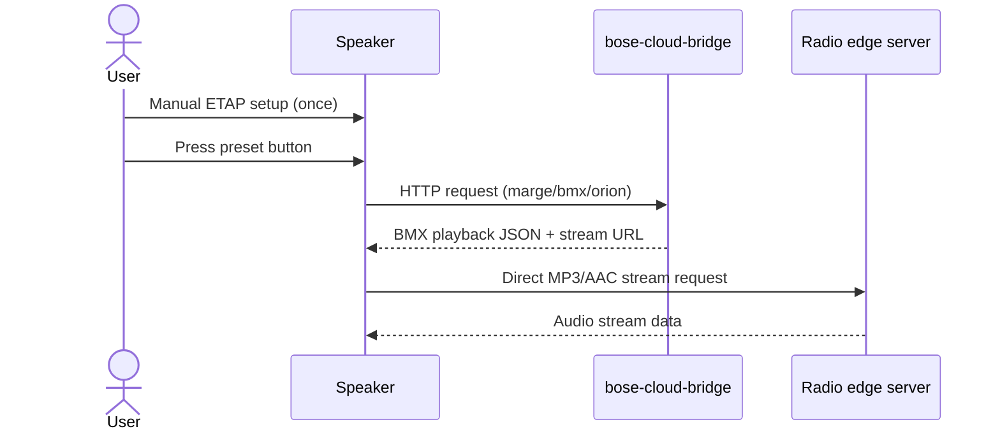

Bose SoundTouch 10 - Radio Bridge
============================================

## Table Of Contents

- [1. Purpose](#1-purpose)
- [2. Architecture](#2-architecture)
- [3. Repo Structure](#3-repo-structure)
- [4. Local Development](#4-local-development)
- [5. Endpoints](#5-endpoints)
- [6. URL Behavior](#6-url-behavior)
- [7. Deploy - AWS](#7-deploy---aws)
- [8. Speaker Configuration (Run Once via ETAP)](#8-speaker-configuration-run-once-via-etap)
- [9. Radio Channels](#9-radio-channels)
- [10. Costs (AWS)](#10-costs-aws)
- [11. Status](#11-status)
- [12. Troubleshooting](#12-troubleshooting)
- [13. Future Improvements (If SSH Access)](#13-future-improvements-if-ssh-access)
- [14. References](#14-references)
- [15. License](#15-license)

## 1. Purpose

Solves the problem that Bose SoundTouch 10 can no longer play
radio streams via preset buttons after Bose shut down its cloud service
on 2026-05-06.

This setup is aimed at people who still want to use the physical preset
buttons for their favorite radio channels and only occasionally change
which stations are stored on those buttons.

The solution is a Go server that emulates the Bose cloud endpoints the
speaker needs to resolve LOCAL_INTERNET_RADIO presets. The server can
run on any reachable host over HTTP, including a local machine or AWS
Lambda.

## 2. Architecture



IMPORTANT: Audio does NOT stream through the server.
  The bridge only returns source metadata and the final stream URL.
  The speaker then fetches audio directly from the radio provider's edge server.

Detailed request order and payload formats are documented in
[docs/details.md](docs/details.md).

## 3. Repo Structure

- `cmd/bose-cloud-bridge/main.go` - Go server entrypoint
- `go.mod` - Go module definition
- `Makefile` - Build, test, and deploy commands
- `.devcontainer/` - Reproducible VS Code dev environment
- [docs/details.md](docs/details.md) - Detailed call order and request format reference
- `infra/aws/template.yaml` - SAM / CloudFormation template
- `.github/workflows/aws-deploy.yml` - GitHub Actions deployment pipeline

## 4. Local Development

You can work either natively on your host machine or inside the provided
VS Code dev container.

Required tools (native setup):
  - Go 1.26+
  - make
  - AWS SAM CLI
  - AWS CLI v2
  - nc (netcat)

Quick start (native):
  make run-local

The server listens on http://localhost:8080.
Endpoints are available directly under /...

Build:
  make build-local

This produces:
  dist/bose-cloud-bridge

Optional build overrides:
  GOOS_TARGET=linux GOARCH_TARGET=amd64 make build-local

SAM local build (same flow as CI):
  make sam-build

Dev container (recommended for reproducible setup):
  1. Open this repo in VS Code.
  2. Run: Dev Containers: Reopen in Container.
  3. Wait for post-create checks (go/sam/aws versions).
  4. Open a new VS Code terminal. It will run inside the container.
  5. Start the bridge inside the container with: make run-local
  6. In the Ports view, remove any existing forwarded entry for port 8080.
  7. Add port 8080 again with Ports: Forward a Port.
  8. In VS Code Settings, set Remote: Local Port Host to all interfaces.

If the speaker should reach the bridge over your LAN, use the forwarded host port
on your machine's LAN IP, not the container-internal address. Re-adding the
forwarded port is useful after changing the local port host behavior so VS Code
recreates the listener with the updated setting.

Troubleshooting: forwarded port still listens only on localhost

- Confirm VS Code setting `Remote: Local Port Host` is set to `all interfaces`.
- In the Ports view, delete the existing forwarded `8080` entry and add it again.
- Restart `make run-local` after re-forwarding if the bridge was already running.
- Verify from another machine on the LAN with `curl http://<host-lan-ip>:8080/healthz`.
- If it still fails, use `Ports: Focus on Ports View` and check that port `8080` is present there, not only in Docker or another extension view.

The dev container includes Go, AWS CLI, SAM CLI, make, jq, nc, and telnet.

## 5. Endpoints

    GET  /healthz
      - Smoke test, returns "ok"

    POST /marge/streaming/support/power_on
      - Returns {} during speaker boot

    GET  /marge/streaming/account/{id}/full
      - Returns account data with LOCAL_INTERNET_RADIO source

    GET  /bmx/registry/v1/services
      - BMX registry, points the orion service to this server

    GET  /orion/station?data=<base64url-JSON>
      - Resolves preset into stream URL
      - data parameter: {"streamUrl":"http://...","name":"P1"}

    GET  /core02/svc-bmx-adapter-orion/prod/orion/<base64url-JSON>
      - Path-style alias used by the speaker during preset playback
      - Returns BMX playback JSON with audio.streamUrl and audio.streams

## 6. URL Behavior

The bridge is configured directly on the speaker with plain HTTP URLs.
Bose normalizes some configured URLs back to the origin/base URL, so the
bridge must work without any secret path prefix.

## 7. Deploy - AWS

Choose one of these deployment paths:

- Option A: Fork repo + GitHub Actions deploy.
- Option B: Manual deploy from terminal with `make`.

Fork path (GitHub Actions):

1. Fork this repository on GitHub.
   If you know the upstream URL, use its fork shortcut:
   `https://github.com/<owner>/<repo>/fork`
2. Add required GitHub secrets in your fork.
3. Run the deploy workflow (`workflow_dispatch`) in Actions.
4. Copy the Function URL from the workflow log output.

GitHub Secrets that must be set:

  AWS_ROLE_ARN   IAM role with Lambda + CloudFormation + S3 + IAM permissions.
                 Trust policy must allow OIDC from github.com for this repo.

Manual deploy from terminal with `make`:

```sh
export AWS_REGION=eu-north-1
export STACK_NAME=bose-bridge

make deploy
make print-function-url
```

First deployment:
  1. Deploy using either Option A or Option B above.
  2. Copy Function URL from workflow logs or `make print-function-url` output.
  3. Use its host and port in the ETAP commands below.

Note:
  - AWS deploy is optional.
  - The verified working setup in this repo also runs on a local machine at a fixed LAN IP and port.

After that, deployment is triggered automatically on push to main when
cmd/bose-cloud-bridge/, infra/aws/, or go.mod changes.

## 8. Speaker Configuration (Run Once via ETAP)

Requirement: firmware 26.0.1 or older.

`sys configuration margeServerUrl` and `bmxRegistryUrl` do not work on newer
firmware. Bose locked these settings in later versions, so downgrading to 26.0.1
is required before ETAP configuration.

Reference guide:

- https://bose.fandom.com/wiki/SoundTouch_Firmware_Downgrade_Guide

Firmware package source (ST10 archive):

- https://archive.org/download/bose-soundtouch-software-and-firmware/Firmware/2015-2020_Bluetooth/Bluetooth_ST10/

Unpack the archive and use `Update.stu` (~95 MB).

### 8.1 Downgrade to Supported Firmware

Method A: USB stick update (service port + OTG)

1. Format a USB stick as FAT32.
2. Copy `Update.stu` to the USB stick root.
3. Power down the speaker while still plugged in.
4. Factory reset: hold preset button 1 + volume down (-) for 10s.
5. Confirm Wi-Fi LED is amber.
6. Unplug power.
7. Insert USB stick into the speaker service port using an OTG adapter.
8. Hold Bluetooth/Aux + volume down (-), then plug power in.
9. Keep holding until LEDs start scrolling/blinking (~5s).
10. Wait for update completion.

Method B: built-in web update page on the speaker (used in this project)

1. Connect the speaker to the computer over USB.
2. Verify CDC Ethernet is detected. Example from `dmesg`:

```text
idVendor=05a7, idProduct=0921, interface cdc_ether.
```

3. Get an IP lease on the USB network interface:

```sh
sudo dhclient <usb_iface>
```

4. Verify route and reachability:

```sh
ip route show dev <usb_iface>
ping -c 3 203.0.113.1
```

5. Confirm ETAP is reachable:

```sh
telnet 203.0.113.1 17000
```

6. Open the firmware update page:

- http://203.0.113.1:17008/update.html

7. Upload or select `Update.stu` and start the update.

Note: the exact USB interface name differs per host, for example `enx...`, and
you may need to try both downgrade methods depending on firmware behavior.

### 8.2 Configure the Speaker to Use the Bridge

Set these shell variables first:

```sh
export SPEAKER_IP=192.168.1.XXX
export BRIDGE_HOSTPORT=192.168.1.XXX:8080
```

Useful local speaker endpoints (port 8090):

```sh
curl http://$SPEAKER_IP:8090/info
curl http://$SPEAKER_IP:8090/now_playing
```

- `/info` returns device and system details.
- `/now_playing` returns the current source and track state.

1. Configure server endpoints once:

```sh
printf "sys configuration margeServerUrl http://$BRIDGE_HOSTPORT/marge\r\n" \
  | nc -w3 "$SPEAKER_IP" 17000

printf "sys configuration bmxRegistryUrl http://$BRIDGE_HOSTPORT/bmx/registry/v1/services\r\n" \
  | nc -w3 "$SPEAKER_IP" 17000

printf "envswitch boseurls set http://$BRIDGE_HOSTPORT http://$BRIDGE_HOSTPORT\r\n" \
  | nc -w3 "$SPEAKER_IP" 17000

printf "sys reboot\r\n" | nc -w3 "$SPEAKER_IP" 17000
```

Notes:

- `envswitch boseurls set` is also required in the working setup.
- Bose normalizes these values to the URL origin/base.
- Keep all bridge endpoints at the URL root; do not rely on a secret path prefix.

2. Verify provisioning after reboot:

```sh
curl http://$SPEAKER_IP:8090/info
curl http://$SPEAKER_IP:8090/sources
```

Expected after a successful bridge boot:

- `/info` shows a non-empty `margeAccountUUID`.
- `/sources` contains `LOCAL_INTERNET_RADIO` with status `READY`.

Notes:

- In the working flow, `margeAccountUUID` is assigned automatically during boot.
- No manual `setMargeAccount` step is required once `margeServerUrl` and `bmxRegistryUrl` are correct.
- If `LOCAL_INTERNET_RADIO` does not appear immediately after changing URLs, reboot the speaker again and re-check `/info` and `/sources`.

The SAM template also outputs the ETAP server configuration commands
as CloudFormation output after deployment.

## 9. Radio Channels

Use this chapter after the speaker has been provisioned successfully and
`LOCAL_INTERNET_RADIO` is visible in `/sources`.

1. Set radio channel presets with the script:

Presets are defined in `config/presets.json`:

- Slots 1-6: P1, P2, P3, P4, Voxpop, Klassiskt.
- Each preset includes `streamUrl` and display name.
- Presets are written directly to the speaker via `/storePreset`.
- The stored `location` is base64url JSON, so playback resolves through `LOCAL_INTERNET_RADIO` on the bridge.

Automated setup:

```sh
./scripts/setup-presets.sh "$SPEAKER_IP"
```

The script will:

1. Read `config/presets.json`.
2. Encode each entry as base64url JSON for `location`.
3. POST it to the speaker's `/storePreset` endpoint.
4. Store the presets persistently on the speaker.

Expected output:

```text
Slot 1 (P1)... ✓
Slot 2 (P2)... ✓
Slot 3 (P3)... ✓
...
```

To customize presets, edit `config/presets.json` before running the script.

TuneIn helper ([TuneIn](https://tunein.com/), resolve + write config + log changes):

```sh
./scripts/tunein-preset-update.sh --slot 1 --name "BBC Radio 1" --id s24939
```

Or search by name:

```sh
./scripts/tunein-preset-update.sh --slot 2 --name "P4 Stockholm" --query "P4 Stockholm"
```

This helper will:

1. Resolve a TuneIn station to a direct or candidate stream URL.
2. Update `config/presets.json` for the selected slot.
3. Append a JSON log entry to `logs/preset-updates.jsonl`.

Test and play directly without writing preset or config:

```sh
./scripts/tunein-preset-update.sh --query "P4 Stockholm" --test-play
```

Optional player selection:

```sh
./scripts/tunein-preset-update.sh --query "P4 Stockholm" --test-play --player ffplay
```

Play directly on Bose without writing preset or config:

```sh
./scripts/tunein-preset-update.sh --query "P4 Stockholm" --play-on-bose "$SPEAKER_IP"
```

Then apply to the speaker:

```sh
./scripts/setup-presets.sh "$SPEAKER_IP"
```

Manual setup if needed:

```sh
STREAM_URL="https://sverigesradio.se/topsy/v2/channels/164/liveaudio/url"
NAME="P1"
DATA=$(printf '{"streamUrl":"%s","name":"%s"}' "$STREAM_URL" "$NAME" | \
  base64 -w0 | tr '+/' '-_' | sed 's/=*$//')

printf "sys preset 1 station $DATA\r\n" | nc -w3 "$SPEAKER_IP" 17000
```

To clear a preset:

```sh
printf "sys preset 1 remove\r\n" | nc -w3 "$SPEAKER_IP" 17000
```

2. Verify presets are saved and playable:

Press preset buttons 1-6 on the speaker. They should play the configured channels.

```sh
curl http://$SPEAKER_IP:8090/presets
curl http://$SPEAKER_IP:8090/now_playing
```

Expected during playback:

- `source=LOCAL_INTERNET_RADIO`
- `playStatus` moves past `BUFFERING_STATE` and audio starts

3. Change radio channels later:

If you want to replace stations after the initial setup, use one of these flows:

Option A: edit the preset file directly

1. Edit `config/presets.json`.
2. Run:

```sh
./scripts/setup-presets.sh "$SPEAKER_IP"
```

Option B: use the TuneIn helper to resolve and update a slot

Examples:

```sh
./scripts/tunein-preset-update.sh --slot 1 --name "BBC Radio 1" --id s24939
./scripts/tunein-preset-update.sh --slot 2 --name "P4 Stockholm" --query "P4 Stockholm"
```

Then write the updated presets to the speaker:

```sh
./scripts/setup-presets.sh "$SPEAKER_IP"
```

Recommended workflow:

- Use the TuneIn helper when you want help resolving a station URL.
- Edit `config/presets.json` directly when you already know the final stream URL.

## 10. Costs (AWS)

Lambda + ARM64 (Graviton2):
  - Free tier: 1 million requests/month + 400,000 GB-s compute
  - Speaker calls server at boot + per button press
  - Expected cost: $0/month for normal home usage

## 11. Status

- Go server implemented with Go stdlib + `github.com/aws/aws-lambda-go` for Lambda runtime integration
- Runs locally and can be deployed to AWS Lambda
- SAM template and GitHub Actions workflow are ready
- Verified working flow: speaker boot provisions LOCAL_INTERNET_RADIO, preset presses hit orionStation, and playback starts from presets

## 12. Troubleshooting

If the speaker does not call expected endpoints, run these two checks first.

1. Verify actual HTTP requests from the speaker to your bridge host:

```sh
sudo tcpdump -ni any -A host "$SPEAKER_IP" and tcp port "${BRIDGE_HOSTPORT##*:}"
```

  This shows request lines such as GET /..., POST /... and quickly reveals
  whether the speaker is calling root or specific API paths.

2. Read active URL configuration from ETAP:

```sh
printf "getpdo CurrentSystemConfiguration\r\n" | nc -w3 "$SPEAKER_IP" 17000
```

  Inspect margeServerUrl and bmxRegistryUrl in the output to confirm what
  URLs are currently active on the speaker.

## 13. Future Improvements (If SSH Access)

On SoundTouch 10 firmware `26.0.1`, SSH access appears locked down in normal
consumer mode.

If SSH access is available (for example via engineering firmware or an unlocked
device), you can run the bridge directly on the speaker and remove the need for
an external server.

Speaker OS details from extracted firmware (`26.0.1.46256.3990103`):

- Embedded Linux on 32-bit ARM (EABI5).
- BusyBox-based userland with SysV init style (`/etc/init.d`, `/etc/rc*.d`).
- ARM GNU/Linux ABI target reported as `GNU/Linux 2.6.31` by firmware binaries.

Tested cross-compile command (from this repo):

```sh
CGO_ENABLED=0 GOOS=linux GOARCH=arm GOARM=7 \
  go build -trimpath -ldflags='-s -w' \
  -o dist/bose-cloud-bridge-linux-armv7 ./cmd/bose-cloud-bridge
```

Measured artifact from the command above:

- `dist/bose-cloud-bridge-linux-armv7`: `5.7M` (`ls -lh` on 2026-05-22)
- UPX test (`upx --best --lzma`) on a copy of the binary: `1.6M` (`1698832` bytes, tested on 2026-05-22)

Example installation as a Linux service on the speaker (SysV-style):

1. Copy binary to the speaker, for example:

```sh
scp dist/bose-cloud-bridge-linux-armv7 root@<speaker-ip>:/usr/local/bin/bose-cloud-bridge
```

2. Create `/etc/init.d/S99bose-cloud-bridge` on the speaker:

```sh
#!/bin/sh
DAEMON=/usr/local/bin/bose-cloud-bridge
PIDFILE=/var/run/bose-cloud-bridge.pid
LOGFILE=/var/log/bose-cloud-bridge.log

start() {
  if [ -f "$PIDFILE" ] && kill -0 "$(cat "$PIDFILE")" 2>/dev/null; then
    echo "already running"
    return 0
  fi
  "$DAEMON" >> "$LOGFILE" 2>&1 &
  echo $! > "$PIDFILE"
}

stop() {
  if [ -f "$PIDFILE" ]; then
    kill "$(cat "$PIDFILE")" 2>/dev/null || true
    rm -f "$PIDFILE"
  fi
}

case "$1" in
  start) start ;;
  stop) stop ;;
  restart) stop; start ;;
  *) echo "Usage: $0 {start|stop|restart}"; exit 1 ;;
esac
```

3. Make it executable and enable startup links:

```sh
chmod +x /etc/init.d/S99bose-cloud-bridge
ln -sf ../init.d/S99bose-cloud-bridge /etc/rc5.d/S99bose-cloud-bridge
ln -sf ../init.d/S99bose-cloud-bridge /etc/rcS.d/S99bose-cloud-bridge
```

4. Start service now:

```sh
/etc/init.d/S99bose-cloud-bridge start
```

Notes:

- Paths and writable partitions vary by image; remount rootfs read-write if needed.
- If `GOARM=7` is not compatible on your unit, retry with `GOARM=6`.

## 14. References

External projects/resources used as references during this work:

- Bose SoundTouch firmware downgrade guide (community wiki):
  https://bose.fandom.com/wiki/SoundTouch_Firmware_Downgrade_Guide
- SoundTouch firmware archive mirror (ST10 packages):
  https://archive.org/download/bose-soundtouch-software-and-firmware/Firmware/2015-2020_Bluetooth/Bluetooth_ST10/
- TuneIn station catalog/service used by preset helper flows:
  https://tunein.com/
- SoundCork project and speaker setup/docs:
  https://github.com/deborahgu/soundcork
  https://github.com/timvw/soundcork/blob/main/docs/speaker-setup.md

Additional relevant community projects (good for comparison and future ideas):

- Ueberboese API:
  https://github.com/julius-d/ueberboese-api
  https://julius-d.github.io/ueberboese-api/quick-start
- Bose-SoundTouch community repo:
  https://github.com/gesellix/Bose-SoundTouch
  https://github.com/gesellix/Bose-SoundTouch/issues/221#issuecomment-4411833149

## 15. License

This project is licensed under the MIT License.
